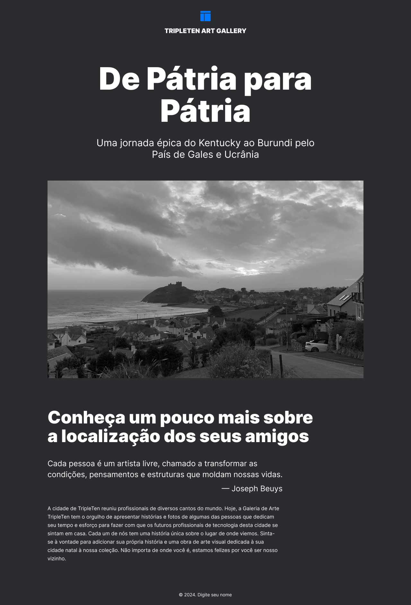

Tripleten Art Gallery

Desenvolvimento de site onepage referente a sprint 5 do curso de "Desenvolvedor Web" da Tripleten.

O projeto tem como objetivo desenvolver uma página sobre a "Galeria de Arte Tripleten" que visa reunir histórias e fotos de algumas das pessoas que atuam no mundo tech. 

Nessa sprint exploramos:

• Desenvolvimento de interface para diferentes dispositivos • Instalação de fonte com @font-face • Git avançando

Foi um projeto bem desafiador!

Este é o link para acesso público: https://kacrisdani.github.io/web_project_homeland_sprint5/

Essa é a aparência do produto final:

